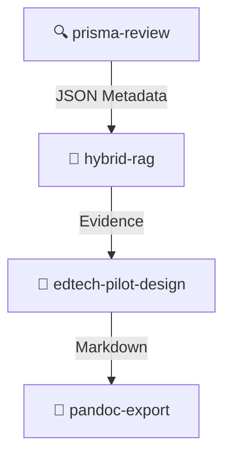

<div align="center">

# 🎓 Academic PRISMA Research Workflow

**Your end-to-end AI research assistant powered by Claude Code**

[](https://www.python.org/)
[](https://www.gnu.org/licenses/agpl-3.0)
[](https://claude.ai/code)

*A complete, rigorous, and automated toolkit covering the full academic pipeline: from PRISMA systematic literature reviews to mixed-methods pilot study design and preprint generation.*

</div>

---

## 🌟 Why this workflow? (Punti di forza)

Conducting academic research requires extreme rigor, especially during systematic literature reviews. This workflow transforms **Claude Code** into a specialized academic assistant that doesn't just "chat" about papers, but actively **executes a structured, reproducible methodology**.

*   **📊 Rigore Metodologico**: Implementa nativamente le linee guida **PRISMA** per le revisioni sistematiche (Screening, Eligibility, Extraction).
*   **🔍 Ricerca Ibrida Avanzata (Hybrid RAG)**: Non si basa solo su embedding semantici. Combina **Dense Vector Search** + **BM25 Sparse Retrieval** + **RRF (Reciprocal Rank Fusion)** per non perdere mai un paper rilevante.
*   **🔌 Integrazione Database Accademici**: Si connette tramite protocollo MCP ai principali database mondiali (Semantic Scholar, PubMed, arXiv, ERIC, OpenAIRE).
*   **📝 Orientato alla Pubblicazione**: Include tool per la progettazione di studi pilota (con focus specifico sul contesto Ed-Tech italiano/MIUR) e l'esportazione automatica in formati standard (Word/DOCX) per l'invio alle riviste.

## 🎯 Ambiti di Utilizzo (Use Cases)

Questo workflow è stato progettato pensando alle esigenze reali dei ricercatori:

*   **Dottorandi e Ricercatori (PhD / Post-Doc)**: Per accelerare drasticamente la stesura del capitolo di *State of the Art* o la redazione di systematic reviews.
*   **Ricerca in ambito Ed-Tech / Scienze della Formazione**: Include un modulo iper-specializzato per progettare studi pilota in ambito scolastico, nel rispetto delle normative italiane (GDPR, INVALSI).
*   **Team di Ricerca Interdisciplinari**: Standardizza il processo di estrazione dati (grazie a template JSON rigidi) riducendo i bias soggettivi.
*   **Ricercatori Indipendenti**: Permette di condurre ricerche bibliografiche estese senza dover acquistare licenze software costose, sfruttando API gratuite.

---

## 🚀 The Core Pipeline

**Five interconnected skills** guide you through the entire research workflow. Just ask Claude Code to start one of these steps:



*   **`[prisma-review]`** → Systematic literature review (PRISMA methodology)
*   **`[hybrid-rag]`** → Local vector database for evidence retrieval
*   **`[edtech-pilot-design]`** → Mixed-methods pilot study design
*   **`[pandoc-export]`** → Export any Markdown output to Word (.docx)

A fifth skill, **`[pipeline-ricerca]`**, serves as a cross-skill reference map with file dependencies and entry points for any stage of the workflow.

---

## 🛠️ Detailed Skills Breakdown

| Skill | Description |
|---|---|
| 📑 **`prisma-review`** | 6-phase PRISMA systematic review with MCP database search (Semantic Scholar, PubMed, ERIC, OpenAIRE), screening, eligibility, data extraction, quality assessment, and RAG-powered report generation. |
| 🧠 **`hybrid-rag`** | Builds and queries a local Hybrid RAG database from PRISMA JSON metadata or PDF documents. Combines dense vector search (ChromaDB or Qdrant + sentence-transformers) with BM25 sparse retrieval and Reciprocal Rank Fusion. |
| 🧪 **`edtech-pilot-design`** | Designs quasi-experimental mixed-methods pilot studies for Ed-Tech research. Covers framework, design, instruments (with Italian validation), power analysis, ethics (GDPR/MIUR), OSF pre-registration, and IMRAD preprint writing. |
| 🗺️ **`pipeline-ricerca`** | Reference map of the full pipeline: file dependencies, handoff points, and 8 entry-point scenarios for resuming mid-workflow. |
| 🖨️ **`pandoc-export`** | Converts Markdown outputs (PRISMA report, pilot protocol, preprint) to Word (.docx) using pandoc. |

---

## 📡 MCP Servers

Two custom MCP servers extend Claude Code's search capabilities directly out of the box:

| Server | API | Target |
|---|---|---|
| 🎓 `eric` | [ERIC API](https://api.ies.ed.gov/eric/) *(free, no key)* | Education Resources Information Center — peer-reviewed ed research |
| 🇮🇹 `ricerca-italia` | [OpenAIRE API](https://graph.openaire.eu/develop/api.html) *(free, no key)* | Italian institutional repositories, European open access |

Additionally, the workflow uses these installable MCP servers:

| Server | Install Command | Notes |
|---|---|---|
| 📚 `semantic-scholar` | `pip install semantic-scholar-fastmcp` | Requires free API key from [semanticscholar.org](https://www.semanticscholar.org/product/api) |
| ⚕️ `pubmed` | `pip install mcp-simple-pubmed` | Free, no key required |
| 🧮 `arxiv` | `pip install arxiv-mcp-server` | Free, no key required |

---

## ⚙️ Installation & Setup

### 1. Install Claude Code
Follow the [official instructions](https://docs.anthropic.com/en/docs/claude-code).

### 2. Copy the Skills
Install the specialized skills into your Claude configuration:
```bash
# Linux / macOS
cp -r skills/* ~/.claude/skills/

# Windows (PowerShell)
Copy-Item -Recurse skills\* $env:USERPROFILE\.claude\skills\
```

### 3. Install MCP Servers
```bash
# 1. Local custom servers (ERIC + OpenAIRE)
cp -r mcp-servers/eric ~/.claude/mcp-servers/
cp -r mcp-servers/ricerca-italia ~/.claude/mcp-servers/

# Register them with Claude Code
claude mcp add eric python ~/.claude/mcp-servers/eric/server.py
claude mcp add ricerca-italia python ~/.claude/mcp-servers/ricerca-italia/server.py

# 2. Install external MCP servers via pip
pip install semantic-scholar-fastmcp mcp-simple-pubmed arxiv-mcp-server

# Register semantic-scholar with your API key
claude mcp add semantic-scholar semantic-scholar-fastmcp \
  -e SEMANTIC_SCHOLAR_API_KEY=your_key_here \
  -e SEMANTIC_SCHOLAR_ENABLE_HTTP_BRIDGE=0

# Register pubmed and arxiv
claude mcp add pubmed mcp-simple-pubmed
claude mcp add arxiv arxiv-mcp-server
```

### 4. Initialize Hybrid-RAG (On First Use)
The `hybrid-rag` skill will copy `hybrid_rag_template.py` to your project folder and run:
```bash
py hybrid_rag.py init      # Windows
python3 hybrid_rag.py init # Linux / macOS
```
*This automatically installs dependencies: `sentence-transformers`, `rank-bm25`, `pymupdf`, `chromadb`.*

### 5. Verify Configuration
```bash
claude mcp list
```
*All servers should show a ✓ Connected status.*

---

## 🕹️ Usage

Start any skill via the `Skill` tool in Claude Code by typing:

```python
Skill("prisma-review")        # Start a new systematic review
Skill("hybrid-rag")           # Build or query the RAG database
Skill("edtech-pilot-design")  # Design a pilot study
Skill("pipeline-ricerca")     # Check workflow status and file map
Skill("pandoc-export")        # Export to Word
```

*💡 Tip: Or just describe your task in natural language — Claude Code will select the relevant skill automatically!*

---

## 📋 Requirements

*   **Claude Code** (any plan)
*   **Python 3.10+**
*   **Pandoc** (for Word export) — e.g., `winget install JohnMacFarlane.Pandoc` on Windows.

---

## 🌍 Language

The skill instructions are natively written in **Italian**, targeting Italian academic researchers (specifically in the Ed-Tech/School sectors). However, the RAG system and MCP tools fully support both Italian and English queries and documents.

---

## ⚖️ License

**AGPL-3.0** — requires anyone who distributes or runs the software as a service to share the source code.
